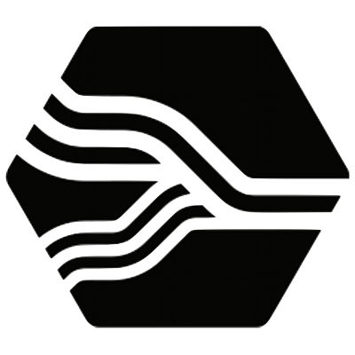

    <h3>Hi 👋, I'm <a href="https://vonng.com/en/">Vonng</a></h3>
     
    

        
        
        
        
    

    

        <a href="https://vonng.com/en/">Profile</a> |
        <a href="https://vonng.com/cn/">Bio</a> |
        <a href="https://vonng.com/cn/posts/">Posts</a> |
        <a href="img/addvon.jpeg">WeChat</a> |
        <a href="https://pg.vonng.com">PG Notes</a> |
        <a href="https://ddia.pigsty.io">DDIA</a> |
        <a href="https://pg-internal.vonng.com">PG Internal</a> |
        <a href="https://capslock.vonng.com">Capslock</a> |
        <a href="https://pgsty.com">Pigsty</a> |
        <a href="https://pgsty.com/zh/blog/">Blog</a>
    

    
💻 PostgreSQL expert, Full-stack engineer, Individual open source contributor, Founder

    
🐘 Author of <a href="https://pgsty.com">Pigsty</a>, Open-Source RDS Alternative, Battery-Included PostgreSQL Distribution

    
⌨️ Author of <a href="http://capslock.vonng.com">Capslock</a>, transform ⇪CapsLock into a new powerful ✱ Hyper modifier

    
🀄️ Translator of two books: <a href="https://ddia.vonng.com">《Designing Data Intensive Application》</a> & <a href="https://pg-internal.vonng.com">《PG Internal》</a>

    

        
        
    

<!--    
-->
<!--        -->
<!--        -->
<!--        -->
<!--        -->
<!--        -->
<!--        -->
<!--        -->
<!--        -->
<!--        -->
<!--        -->
<!--        -->
<!--        -->
<!--        -->
<!--        -->
<!--    
-->
<!--    
-->
<!--        -->
<!--        -->
<!--        -->
<!--        -->
<!--        -->
<!--        -->
<!--        -->
<!--        -->
<!--        -->
<!--        -->
<!--        -->
<!--        -->
<!--        -->
<!--        -->
<!--    
-->
<!--    
-->
<!--        -->
<!--        -->
<!--        -->
<!--        -->
<!--        -->
<!--        -->
<!--        -->
<!--        -->
<!--        -->
<!--        -->
<!--        -->
<!--        -->
<!--        -->
<!--        -->
<!--    
-->

